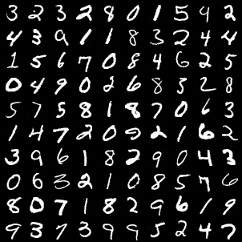
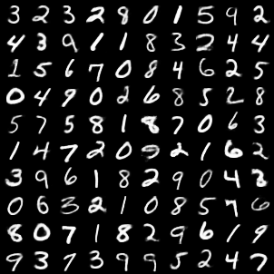
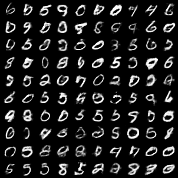

# Pytorch implementation of Wasserstein Auto-Encoders
The reference of this code is the original implementation in TensorFlow:
<https://github.com/tolstikhin/wae/>

##### The results of epoch 100 are as follow:
##### real images
 
##### recon images
 
##### sample images

